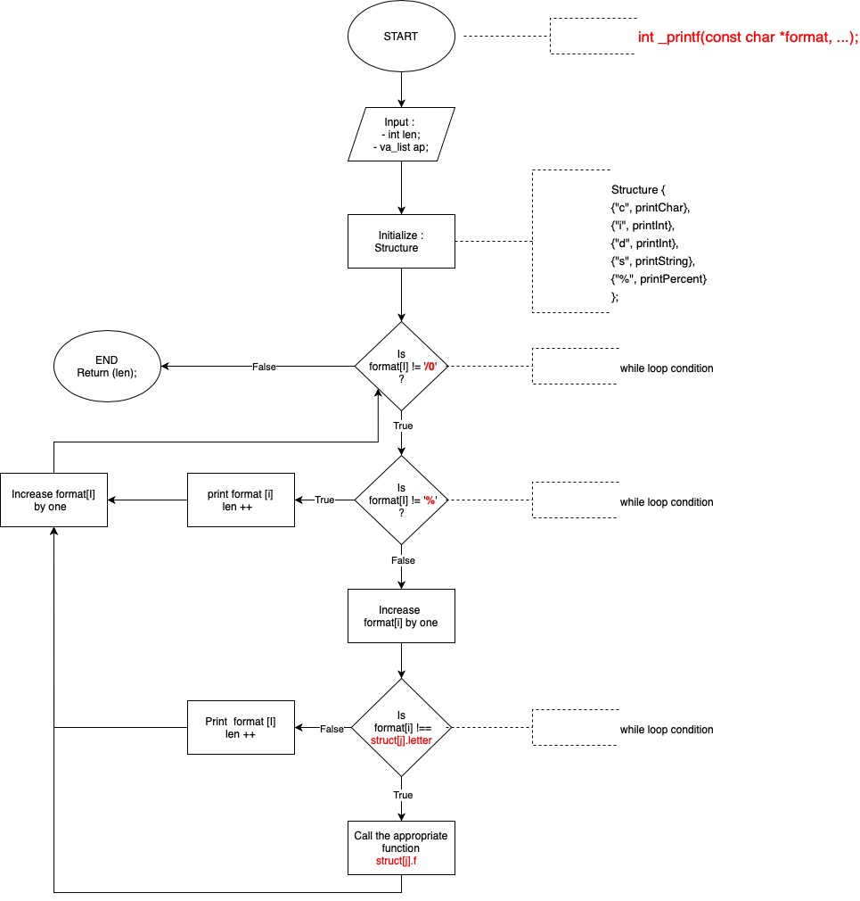

# C - printf

## Introduction
This repository is about our first major project after two months learning C programming language at Holberton School. 
The project was to create a "```printf``` like" function.
We have done this project in teams of two people in four days.


## Instructions
***Write your own ```printf``` function.***

### Requirements
#### General
* Allowed editors: ```vi```, ```vim```, ```emacs```
* All your files will be compiled on Ubuntu 20.04 LTS using ```gcc```, using the options ```-Wall -Werror -Wextra -pedantic -std=gnu89 -Wno-format *.c```
* A ```README.md``` file, at the root of the folder of the project is mandatory
* Your code should use the ```Betty``` style. It will be checked using ```betty-style.pl``` and ```betty-doc.pl```
* You are not allowed to use global variables
* No more than 5 functions per file
* The prototypes of all your functions should be included in your header file called ```main.h```

#### Authorized functions and macros
* ```write``` (```man 2 write```)
* ```malloc``` (```man 3 malloc```)
* ```free``` (```man 3 free```)
* ```va_start``` (```man 3 va_start```)
* ```va_end``` (```man 3 va_end```)
* ```va_copy``` (```man 3 va_copy```)
* ```va_arg``` (```man 3 va_arg```)

### Tasks
#### 0. Write a function that produces output according to a format.
* Prototype: ```int _printf(const char *format, ...);```
* Returns: the number of characters printed (excluding the null byte used to end output to strings)
* write output to stdout, the standard output stream
* You need to handle the following conversion specifiers:
    - ```c```
    - ```s```
    - ```%```
* You don’t have to reproduce the buffer handling of the C library ```printf``` function
* You don’t have to handle the flag characters
* You don’t have to handle field width
* You don’t have to handle precision
* You don’t have to handle the length modifiers

#### 1. Handle the following conversion specifiers:
* ```d```
* ```i```
* You don’t have to handle the flag characters
* You don’t have to handle field width
* You don’t have to handle precision
* You don’t have to handle the length modifiers

#### 2. Create a man page for your function.

## Flowchart
Before coding, we drawn this flowchart to have an idea of how do we have to build the function : 




## Exemples
Once the function done, we made some tests to compare the result with the real ```printf``` function :
```
benjamin$ cat main.c
#include <stdio.h>
#include "main.h"
/**
* main - Entry point
*
* Return: Always 0
*/
int main(void)
{
	int len = 0;
	int len2 = 0;
	char character = 'K';
	char character2 = 0;
	char *string = "this is another one";
	char *string2 = NULL;
	int number1 = 4521;
	int number2 = -345;

	len = _printf("This is a string and %s.\n", string);
	len2 = printf("This is a string and %s.\n", string);
	_printf("The length of our function is %d.\n", len);
	printf("The length of original printf function is %d.\n", len2);
	len = _printf("Test with number : %d, %d, %d.\n", 10, number1, number2);
	len2 = printf("Test with number : %d, %d, %d.\n", 10, number1, number2);
	_printf("The length of our function is %d.\n", len);
	printf("The length of original printf function is %d.\n", len2);
	len = _printf("Some more test : %%, %c, %c.\n", character, 'L');
	len2 = printf("Some more test : %%, %c, %c.\n", character, 'L');
	_printf("The length of our function is %d.\n", len);
	printf("The length of original printf function is %d.\n", len2);
	len = _printf("Test with NULL and 0: %s, %c, %d.\n", string2, character2, 0);
	len2 = printf("Test with NULL and 0: %s, %c, %d.\n", string2, character2, 0);
	_printf("The length of our function is %d.\n", len);
	printf("The length of original printf function is %d.\n", len2);
	return (0);
}
benjamin$ gcc -Wall -Werror -Wextra -pedantic -std=gnu89 -Wno-format *.c && ./a.out
This is a string and this is another one.
This is a string and this is another one.
The length of our function is 42.
The length of original printf function is 42.
Test with number : 10, 4521, -345.
Test with number : 10, 4521, -345.
The length of our function is 35.
The length of original printf function is 35.
Some more test : %, K, L.
Some more test : %, K, L.
The length of our function is 26.
The length of original printf function is 26.
Test with NULL and 0: (null), , 0.
Test with NULL and 0: (null), , 0.
The length of our function is 36.
The length of original printf function is 36.
benjamin$
```
## Authors
This project was realized by Christophe Ngan (@Sirothpech) & Benjamin Vandamme (@BenJamminDev)
